## Part 1. Установка ОС

**Установлен `Ubuntu 20.04 Server LTS`[^1] без графического интерфейса.
команда для просмотра `cat /etc/issue`**
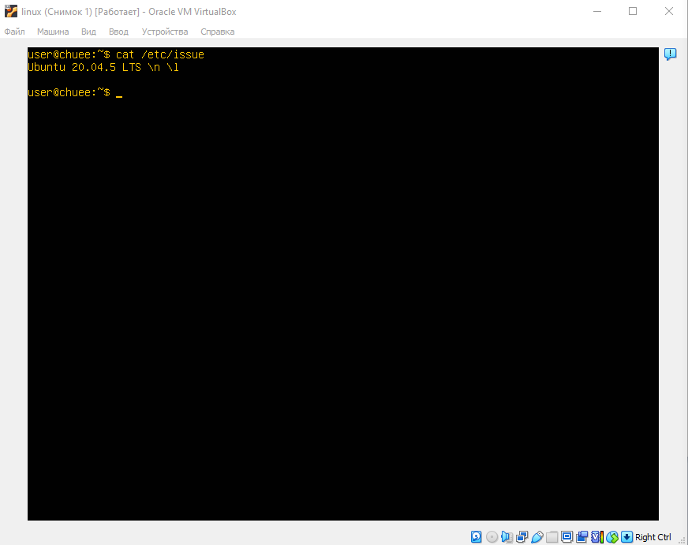

---

## Part 2. Создание пользователя

**1. Создаю нового пользователя командой `sudo adducer` username (вместо username мы должны записать имя пользователя который мы создадим, в моём случае "new")**

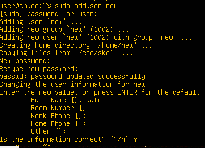

**2. даю права командой `sudo usermod -aG adm user`**

**3. перехожу к пользователю командой `sudo su user`**

**4. проверяю записался ли мой новый пользователь в группу командой `groups`**

**5. и в конце проверка командой `cat /etc/passwd`**

---

## Part 3. Настройка сети ОС

**1. `sudo hostname user-1` - меняем имя хоста**

**2. `cat /etc/hostname` - проверяем поменялось ли если да то все четко, если нет то**
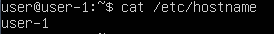
**3. `sudo vim /etc/hostname` - этой командой вручную меняем**

**4. `sudo vim /etc/hosts` - и в этом файле тоже**

**5. `sudo timedatectl set-timezone Europe/Moscow` - меняем часовой пояс**

**6. Проверяем этими двумя командами `timedatectl` и `cat /etc/timezone`**
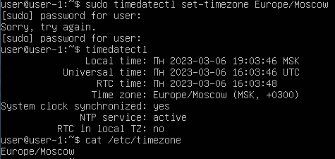

**7. `sudo apt install net-tools` - скачиваем `net-tools`**
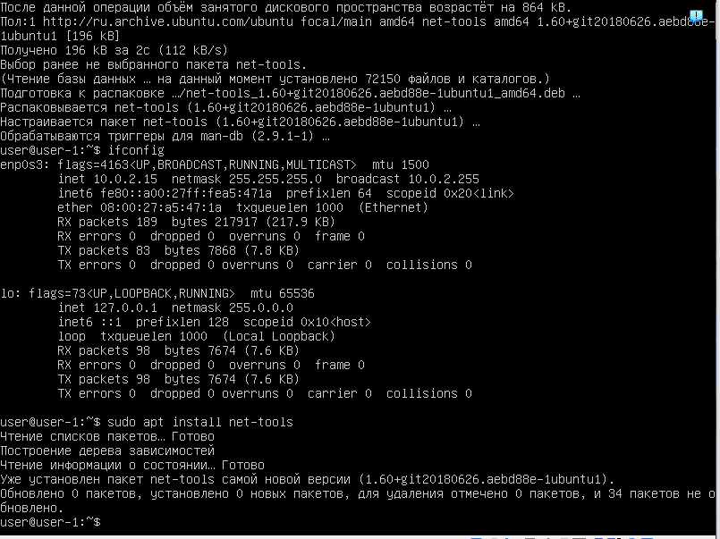

**8. `ifconfig` - для просмотра нашей сетевой конфигурации**

**9. Сбрасываем свой старый ip адрес командой `sudo dhclient -r enp0s3`**
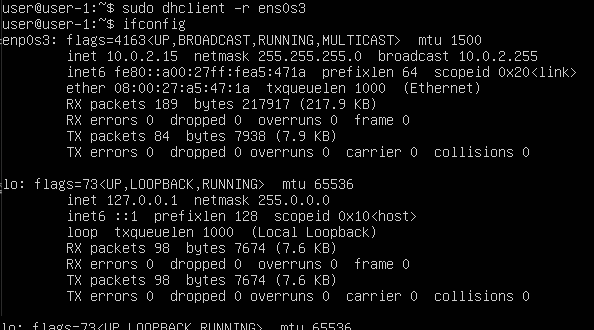

**10. И получаем новый командой `sudo dhclient -v enp0s3`**
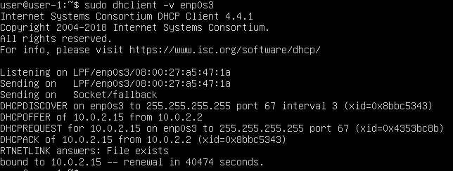

**11. Проверить все это можно командой `ifconfig`**
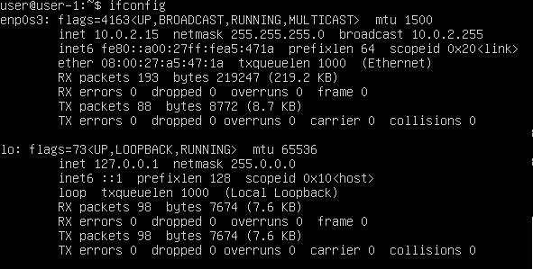

**12. Узнаем свой внешний ip address командой `wget -O - -q icanhazip.com`**

**13. Внутренний ip можно узнать командой `route -n`**
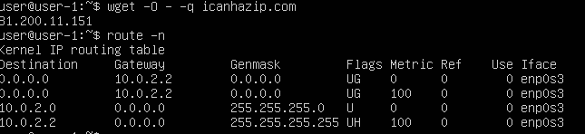

**`ls /etc/netplan` - проверяем директорию**

**14. `sudo vim /etc/netplan/00-installer-config.yaml` - В этом файле у нас уже имеется шаблон для нашей сети**
**enp0s3. Наша задача - отключить получение адресов от DHCP и присвоить свой статический адрес. Для этого**

**15. `"dhcp4: true"` меняем на `"dhcp4: false"` и ниже добавляем строки с выбранным нами IP, шлюзом и** **DNS-серверами**

**16. Сначала смотрим наш шлюз командой `route -n`, в этом диапазоне адресов задаём IP, а в качестве DNS выбираем гугловские `1.1.1.1 и 8.8.8.8`, как и рекомендуется в задании**
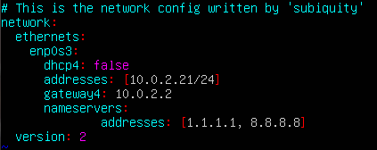

**17. `sudo netplan apply` - для применения конфигураций**

**18. `sudo netplan try` - для применения изменений**

**19. `ifconfig` - проверяем получили ли мы статистический айпишники**
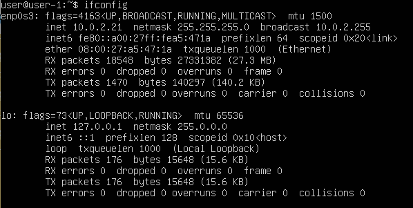

**20. `ping ya.ru` - и убеждаемся что все работает**
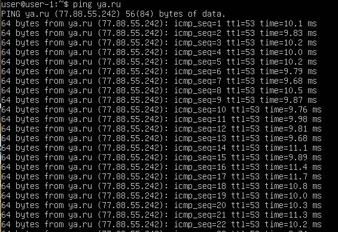

---

## Part 4. Обновление ОС

**1. `sudo apt update` - обновляю Ubuntu**
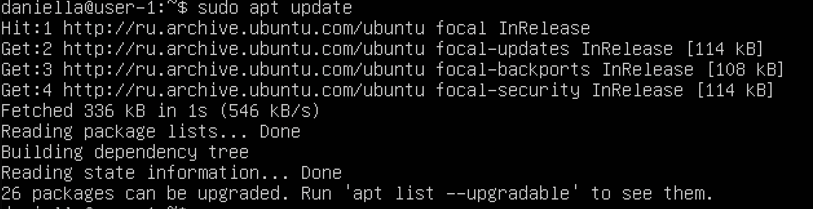

**2. `sudo apt dist-upgrade` - обновляю версию пакетов**
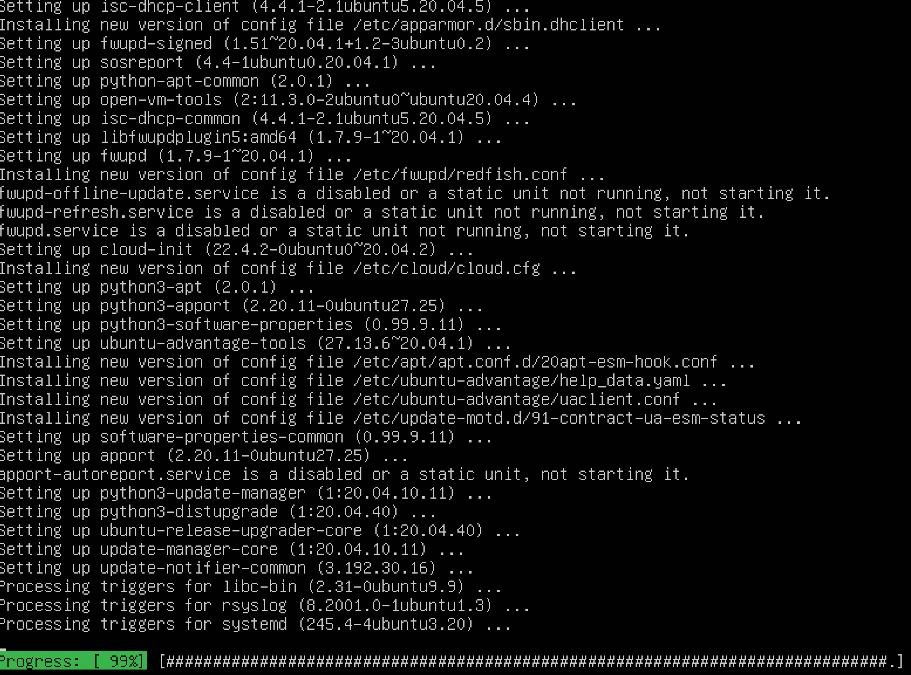

**3. И `sudo apt update` проверю на обновление**
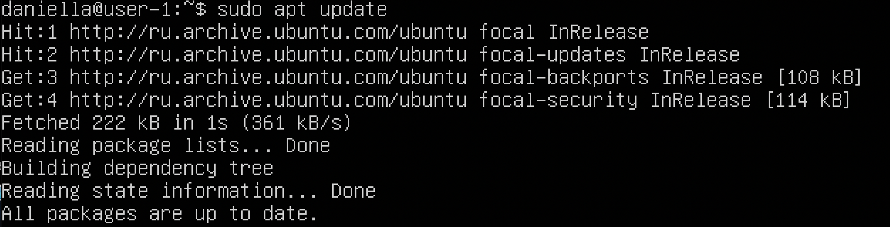

---

## Part 5. Использование команды sudo

**1. Команда sudo - позволяет строго определенным пользователям выполнять указанные программы с административными привилегиями без ввода пароля суперпользователя root**

**2. `sudo touch /etc/sudoers.d/new` - создаю файл для нашего пользователя**

**3. `sudo vim /etc/sudoers.d/new` - открываю в вим и записываю такую строку `new ALL=(ALL:ALL) ALL`[^9]**
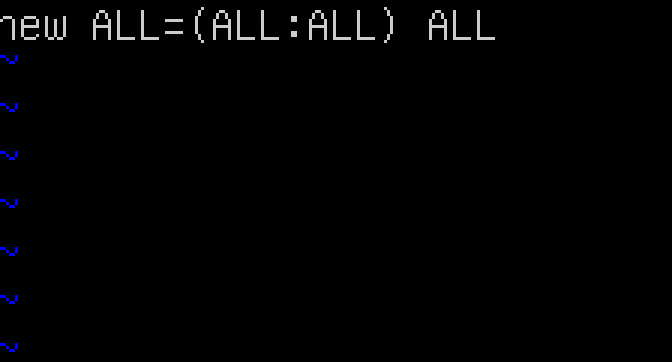

**4. И перехожу к нему командой su new**
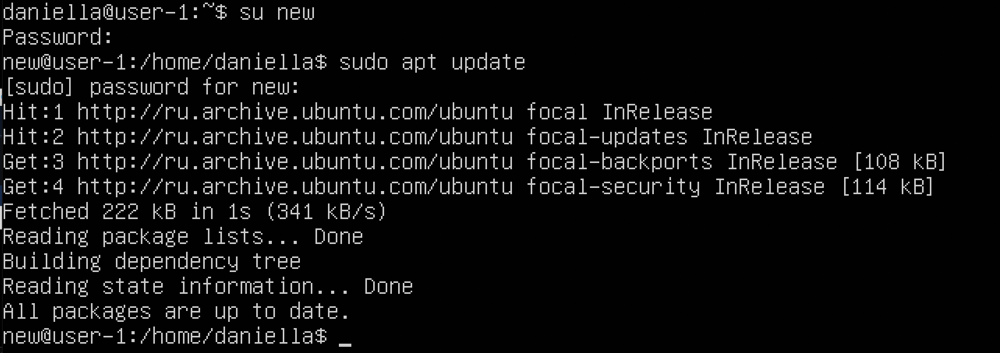

**5. И проверим командой `sudo apt update` чтобы убедится что все работает**
**6. `sudo vim /etc/hostname` - поменяю на new**

**7. Перезапускаем виртуальную машину и видим внесенные изменения.**
 
---

## Part 6. Установка и настройка службы времени

**1. `sudo apt install -y ntp` - устанавливаем**
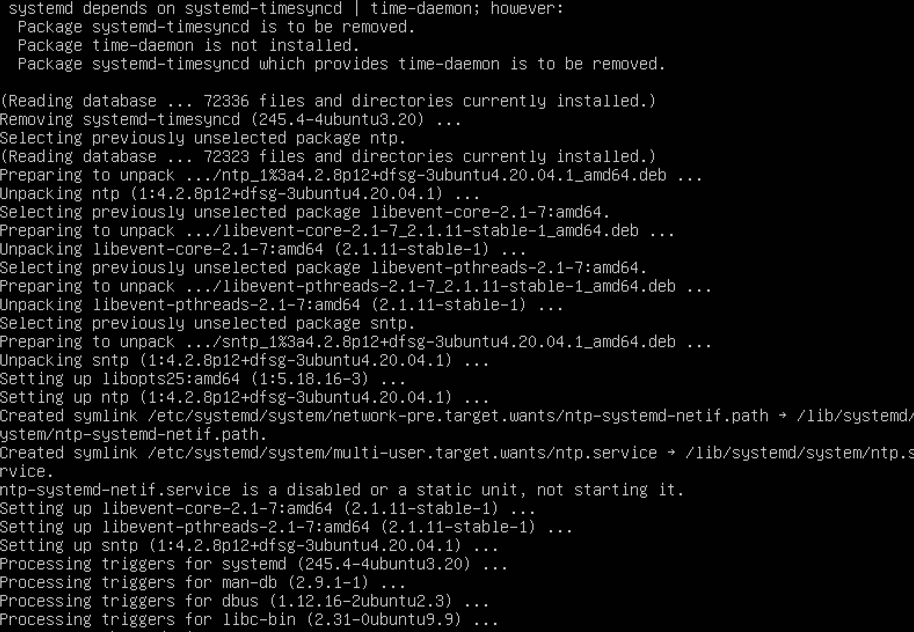

**2. `dpkg -l | grep "ntp"` - проверяем все ли установилось успешно**
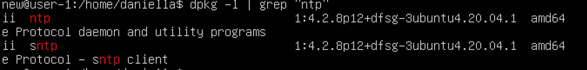
**3. `sudo apt update` - снова обновляем чтобы проверить все ли нормально**

**4. `ntpq -p` - Проверим, что `ntp` подключён к серверам времен**
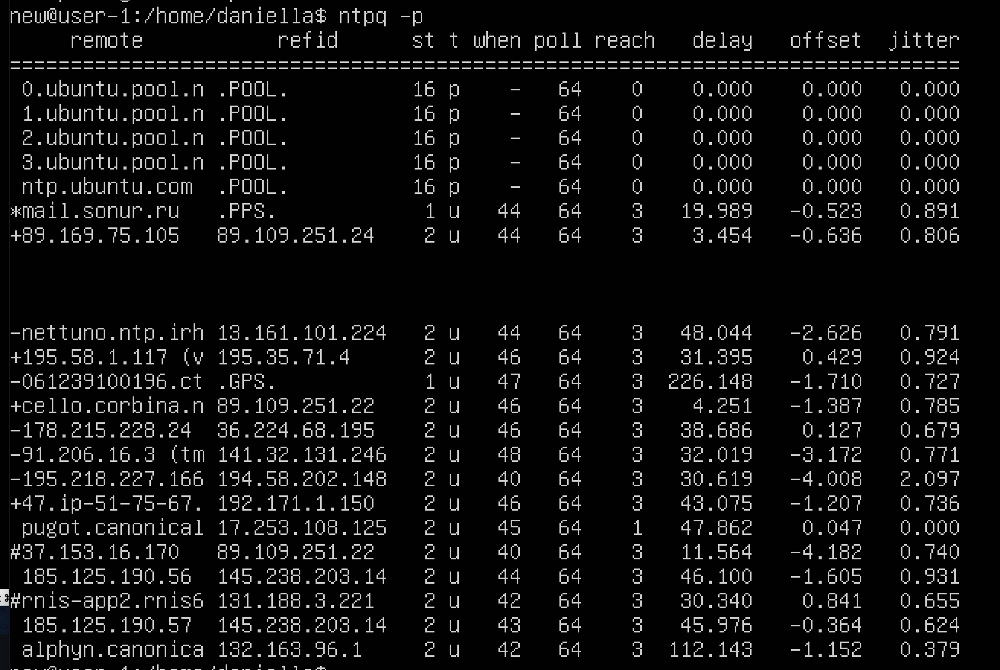

**5. `sudo systemctl stop ntp` - остановим нашу команду**
**6. `sudo ntpd -gq` - и принудительно синхронизируем все это**
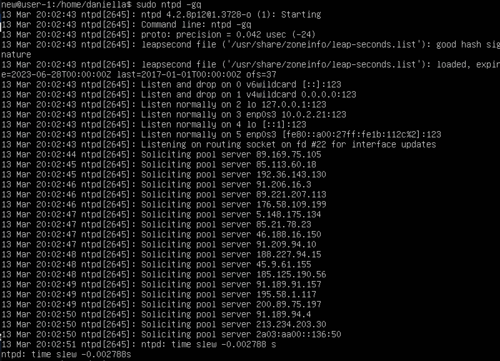

**7. `sudo systemctl start ntp` - снова все запускаем**
**8. `sudo systemctl status ntp` - и убеждаемся что все нормально**
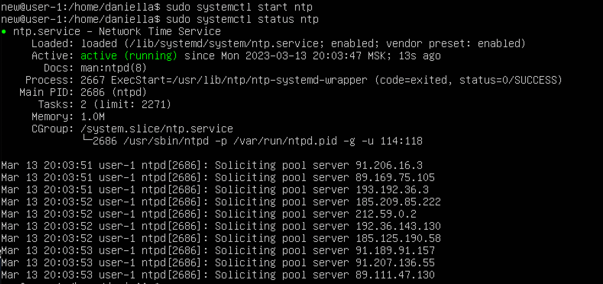

**9. `timedatectl show` - и в конце проверяем еще раз**
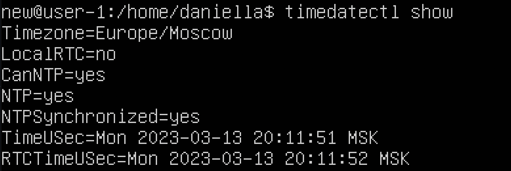

---

## Part 7. Установка и использование текстовых редакторов

###JOE
**1. `sudo apt install Joe` - скачиваю `Joe` текстовый редактор.**
**и есть у нас уже установленные два редактора это vim и nano**
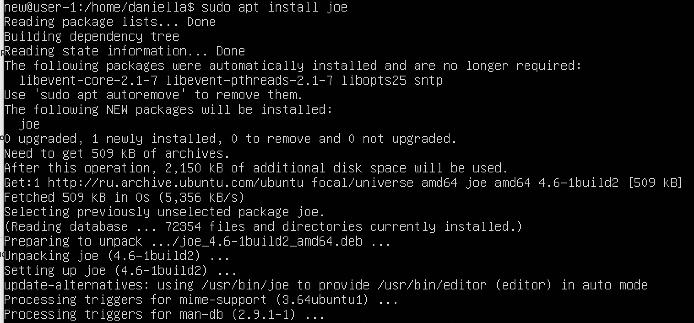
**2. `sudo Joe test_JOE.txt` - создаю .txt файл и открываю его для записи**
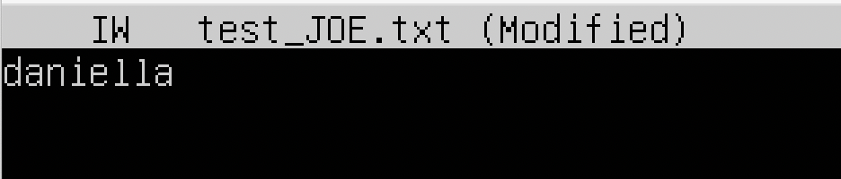
**Записал все что мне нужно**
**3. `control+k` а потом нажимаю `Q` и он спросит сохранить изменения.**
**я нажимаю кнопку y и он все сохранит и выйдет**
**4. Снова открывю файл и меняю содержимое на `21 School 21`, но уже без сохраниния**
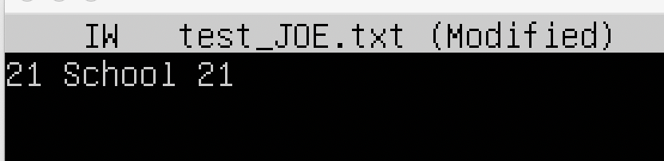
**Проверим, что файл, остался без изменений**

**5. Для поиска я нажимаю `control+k` и потом `f`**
**6. И пишу исомое слово и `enter`**

**7. И нам показывают еще несколько команд, из них нам понадобиться только `R`**
**8. И слово на которое мы заменим в моем случае это `daniella`**

**9. Сохраняем и выходим**

###VIM
**1. `sudo vim test_VIM.txt` - создаю `.txt` файл и открываю его для записи**
**2. Нажимаю `i` чтобы у меня появился возможность писать**
**3. Пишу свой юзернейм нажимаю `escape`**
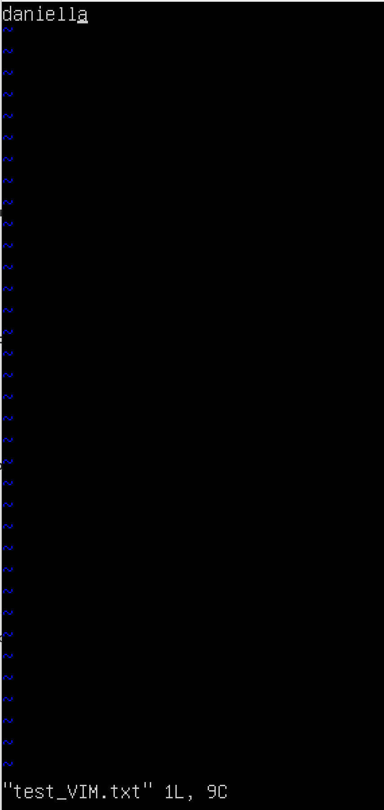
**4. `:wq` и добавляю вот таким образом команду чтобы оно сохранилось и вышло**
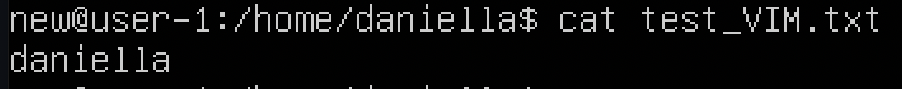
**5. `sudo vim test_VIM.txt` - открываю файл заново для записи**
**6. Нажимаю кнопку `i` чтобы у меня появилось возможность писать**
**7. Меняю `user3` на `21 School 21`**
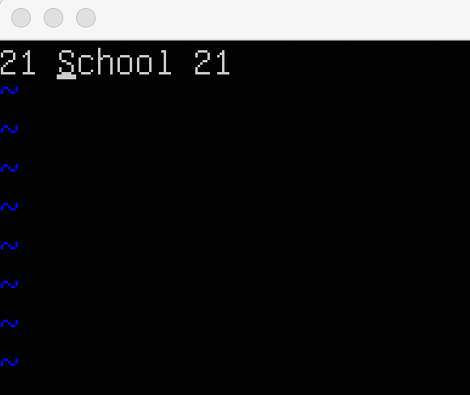
**8. Нажимаю `escape`**
**9. `:q!` - и ставлю вот такую команду для того чтобы он вышел не сохраняя изменения**
**10. Проверяем командой `sudo cat test_VIM.txt`**

**11. Для поиска и замены нам понадобится открыть файл**
**12. Нажать `escape` и ввести `:s/искомое слово/слово на которую мы заменим/g` - этот флаг отвечает за то чтобы во всем текстовом файле искомое слово заменили**
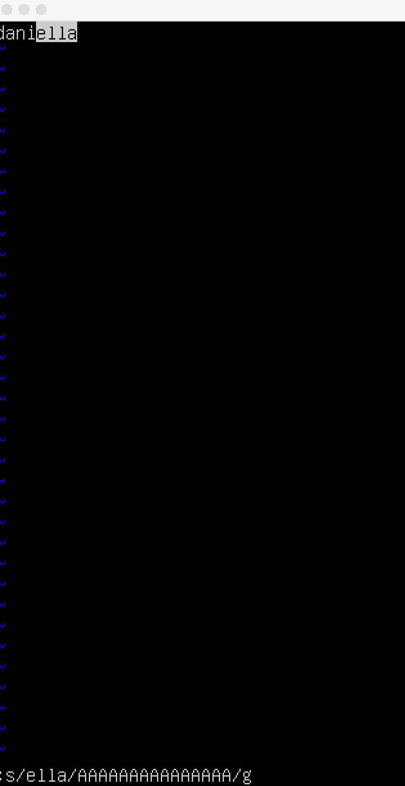
**13. Сохраняем и выходим**
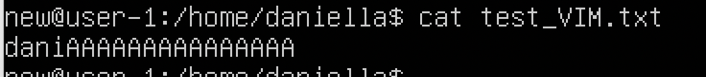

###NANO
**1. `sudo nano test_NANO.txt` - создаю `.txt` файл и открываю его для записи**

**2. Записываю. Нажимаю команду `control+x`**
**3. И меня спрашивают сохранить изменения? Я пишу `y` и нажимаю кнопку `enter`**
**И он сохраняет и выходит.**
**4.Снова открывем файл и переписываем его на 21 Shooll 21**
 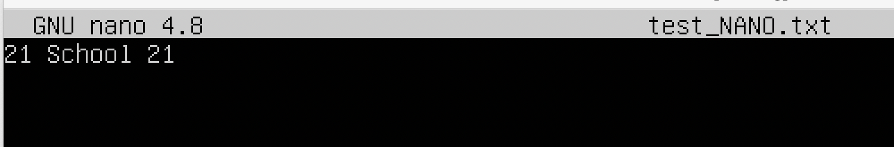
**а не сохранения изменений аналогично но вместо `y` нужно нажать кнопку `n` и `enter`**
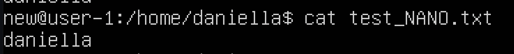
**5. А для того чтобы он произвел поиск и замену текста мы нажимаем `control+\`**
**6. И внизу (как на фото) появится поле для слово которое мы ищем. В моем случае это `ll`**
**7. И нажимаю `enter`**
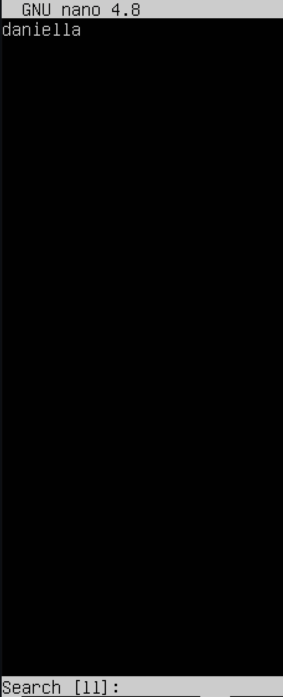
**8. И так у нас появился еще что-то. В этот раз в то же место мы записываем слово на которую мы хотим поменять**
**9. И он нас спрашивает заменить? Мы говорим да и жмем кнопку `y`**
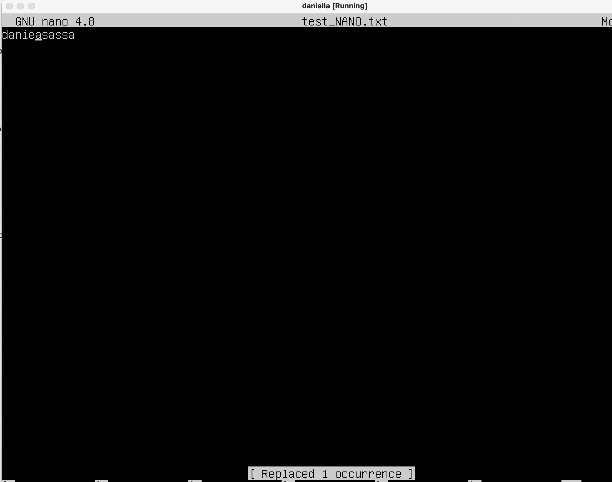
**10. И сохраняем и выходим**

**И смотрим конечный результат всех файлов**
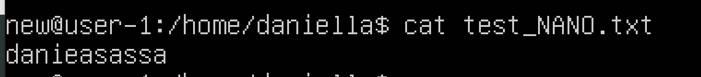

---

## Part 8. Установка и базовая настройка сервиса SSHD[^8]

**1. В настройках `VirtualBox` нужно добавил сеть с именем SSHD с портом хоста 2022 и с портом гостя 2022**

**2. Установка `ssh` командой `sudo apt install ssh`**

**3.Через `sudo vim /etc/ssh/sshd_config`**
**4.Открыл файл и раскоментировал `Port 2022` и изменил его на `Port 2022`. Так же разрешил логиниться под `root` (в конце когда все получиться я закоменчу обратно)**
**и еще разрешаем логин по ключу и паролю(тоже закоменчю для безопасности)**

**5. Сохранил и перезапустил командой `sudo service sshd restart`**
**6. Проверю командой `sudo service sshd status`**

**7. потом проверил стату фаербола командой `sudo ufw status` оно было `inactive` и я исправил это командой `sudo ufw enable`**
**8. Открываю порт командой `sudo ufw allow 2022` и еще раз проверил статус на всякий случай**

**9. Открываю терминал и перешел в директорию где лежит мой `ubuntu`**
**10. И пишу вот такую команду `ssh user@localhost -p 2022` чтобы подключиться к серверу**

**11. Открываю новый терминал и перехожу в папку `.ssh`**
**12. Cоздаю директорию `mkdir ubuntu_01 && cd ubuntu_01` и перехожу к нему**
**13. Узнаю его адрес `pwd`**
**14. Cоздаю `ssh` ключи командой `ssh-keygen`**
**15. Вставляю полученный адрес (от pwd) и +id_rsa. ключ сгенерирован**
**16. Командой `ssh-copy-id id_rsa.pub user@localhost -p 2022` добавляю ключ на сервер**
**17. И проверяю (сравниваю) `sudo cat ~/etc/.ssh/authorized_keys`**

**18. Создаем файл с конфигурацией для `ssh`**
**19. `sudo vim ~/.ssh/config` и туда записывал**
**`Host localhost`**
**`     IdentityFile ~/.ssh/ubuntu_01/id_rsa`**
**20. Созранил и закрыл**
**21. Делаю перезапуск командой `sudo service sshd restart`**
**22. И сделал нужные скриншоты**

---

## Part 9. Установка и использование утилит `top, htop`[^7]

**1. Установка**

**uptime - 4min**
**количество авторизованных пользователей - 1**
**общую загрузку системы - 0.06, 0.25, 0.14**
**общее количество процессов - 110 total, 1 running, 109 sleeping, 0 stopped, 0 zombie**
**загрузку cpu - 0,0 us, 0,0 su, 0,0 ni, 100,0 id, 0,0 wa, 0,0 hi, 0,0 si, 0,0 st**
**загрузку памяти - 1983,2 total, 1503,2 free, 166, 1 used, 313,9 buff/cache**
**pid процесса занимающего больше всего памяти - 730**
**pid процесса, занимающего больше всего процессорного времени - 2398 user**

**2. отсортировка по `PID`**

**3. отсортировка по `PERCENT_CPU`**

**4. отсортировка по `PERCENT_MEM`**

**5. отсортировка по `TIME`**

**6. отфлиртованный процесс `sshd`**

**7. `syslog`**

**8. с добавление `hostname, clocl, uptime`**

---

## Part 10. Использование утилиты `fdisk`[^6]

**1. `/dev/sda 10GIB, 10737418240 bytes, 20971520 sector`**

**2. `/swap.img file 1,5 GB -2`**

---

## Part 11. Использование утилиты `df`[^5]

**1. Для корневого раздела c командой `df /`**
**размер раздела - 8408452**
**размер занятого пространства - 4276304**
**размер свободного пространства - 3683432**
**процент использования - 54%**
**Определить и написать в отчёт единицу измерения в выводе: Килобайт**

**2. Для корневого раздела с командой `df -Th /`**
**размер раздела - 8,1G**
**размер занятого пространства - 4,1G**
**размер свободного пространства - 3,6G**
**процент использования - 54%**
**тип файловой системы для раздела : ext4**

---

## Part 12. Использование утилиты `du`[^4]

**1. `du -bh /home`**

**2. `du -bh /var`**

**3. `du -bh /var/log`**

**4. `du -bh /var/log/*`**

---

## Part 13. Установка и использование утилиты ncdu

**1. Установка с командой `sud apt install ncdu`[^3]**

**2. `/`**

**3. `/home`**

**4. `/var`**

**5. `/var/log`**

---

## Part 14. Работа с системными журналами

<!-- **Просмотр `/var/log/syslog`**

**Просмотр `/var/log/dmesg`**
 -->

**1. Открываю лог (другие файлы открываем тоже таким же образом)**
**последний вход был в: 16:38**
**имя пользователя: user**
**способ входа через пароль: но эту информацию он не показывает**

**2. Перезапустил и заново открыл**

---

## Part 15. Использование планировщика заданий CRON

**1. для создания задачи я открыл файл планировщик командой `contrab -e`[^2] и вписал следующую строку [^10]**

**2. и убеждаемся что он работает**

<!-- **3. показываем syslog**

**4. Удаляю все задания с планировщика**
 -->

---

[^1]: https://releases.ubuntu.com/focal/
[^2]: Выбор текстового редактора по умолчанию
[^3]: Можно использовать эту (ncdu) для проверки дискового пространства
[^4]: Команда du нам позовляет вывести размер всех файлов в определенной папке
[^5]: Команда df нам выводить список подключенных устройств но и информацию о занятом месте
[^6]: Команда fdisk - общее название системных утилит для управления разделами жёсткого диска. Широко распространены и имеются практически в любой операционной системе, но работают по-разному. Используют интерфейс командной строки
[^7]: Команда top - консольная команда, которая выводит список работающих в системе процессов и информацию о них. htop - показывает динамический список системных процессов, список обычно выравнивается по использованию CPU. В отличие от top, htop показывает все процессы в системе. Также показывает время непрерывной работы, использование процессоров и памяти
[^8]: https://www.youtube.com/watch?v=Yxx0F2rnnow
[^9]: это говорит о том, что любой пользователь может запускать любую команду на любом хосте как любой пользователь, и да, пользователь просто должен пройти аутентификацию, но с паролем другого пользователя, чтобы запустить что-либо.
[^10]: https://crontab.guru/every-2-minutes

<!-- [^3]: НЕ ЗАБУДЬ ДОДЕЛАТЬ -->